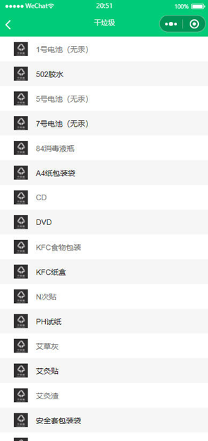
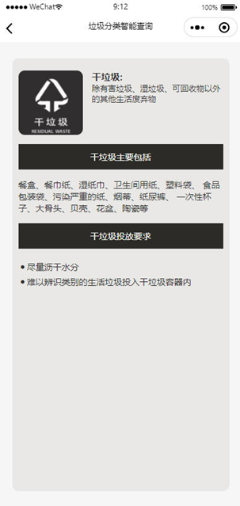
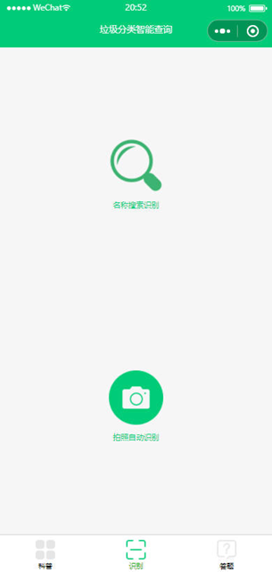
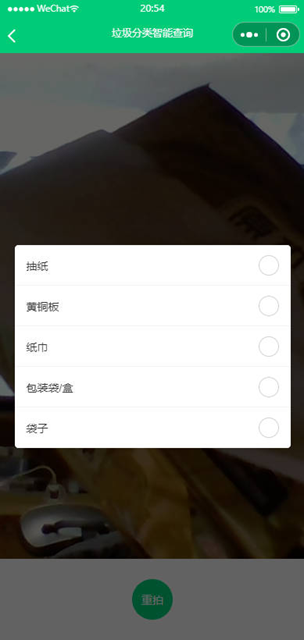
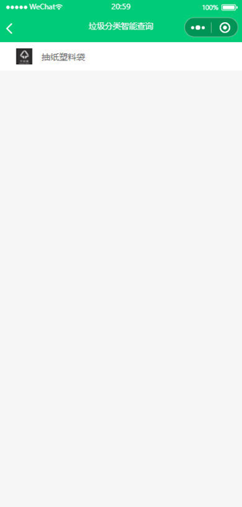
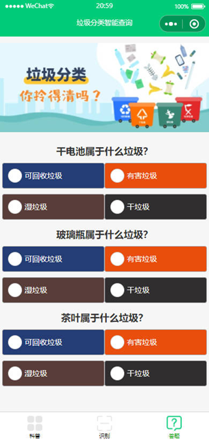
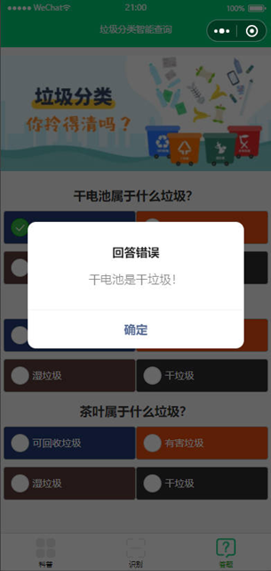
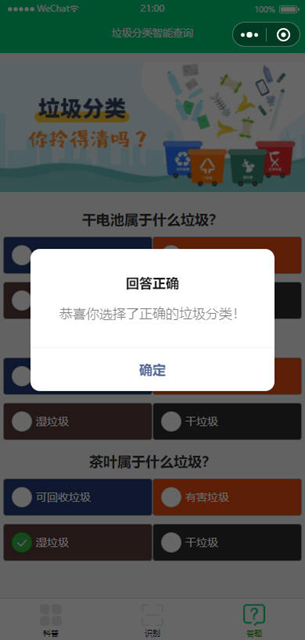

# README

垃圾分类小程序，基于开源项目改写：小程序使用云开发，可以通过关键字搜索和拍照搜索

项目搭建：

- 在云开发平台中新建数据库：存储四种垃圾分类的相关垃圾数据， 创建表commit，sort，product

  把sort.json 和product.csv 导入云数据库即可

  小程序key 在文件project.config.json->appid 记住创建小程序的时候选择云开发

- 获取百度识别库的accessToken（用于垃圾图片的识别）：[百度AI识别库地址](http://ai.baidu.com/docs#/ImageClassify-API/ebc492b1)

  百度key：主要做拍照识别的cloudfunctions->baiduaccesstoken->index->apiKey和secretKey
  此处替换为：API Key 和 Secret Key

垃圾分类的结果是通过对数据库的查找，从而给出匹配结果

小程序设计了三个界面：

- 科普界面

  功能：查看四大垃圾分类的具体常见垃圾列举；科普垃圾分类的简记口诀

  具体界面：

  科普模块的核心功能是中间的四个垃圾分类的可点击模块，点击想要了解的分类科普，可以跳转到其具体的部分来这一个分类有哪些具体的垃圾，当点击干垃圾时，会跳转到如下的界面

  

- 识别界面

  功能：垃圾关键词查询搜索；智能拍照识别垃圾分类

  具体界面：

  用户可以识别模块中进行某个垃圾的分类查询，简洁明了的交互界面可以使用户使用体验更加舒适，对于图片智能识别的测试，点击识别模块中的拍照自动识别，小程序会跳转到拍照模块，在拍完物品照片后，小程序会调用百度识图API，识别图片中的物品，并返回多个可能的名称，将对于的名称传递给数据库进行分解结果的匹配：

  

- 答题界面

  功能：选择某个垃圾正确的分类

  具体界面：

  答题模块在本小程序系统中作为一个辅助的模块，用户可以在该模块下进行答题测试，判断自己的垃圾分类知识水平

  
